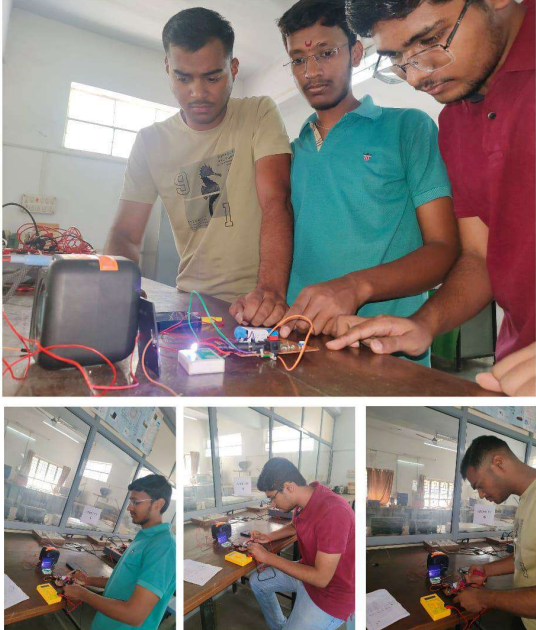
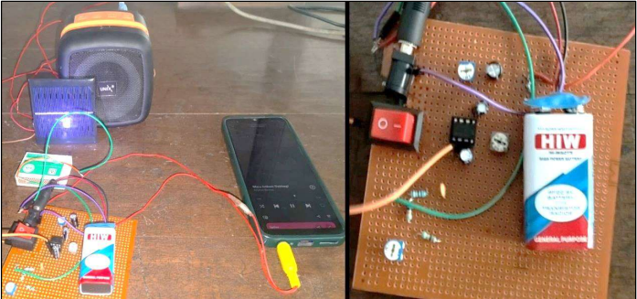
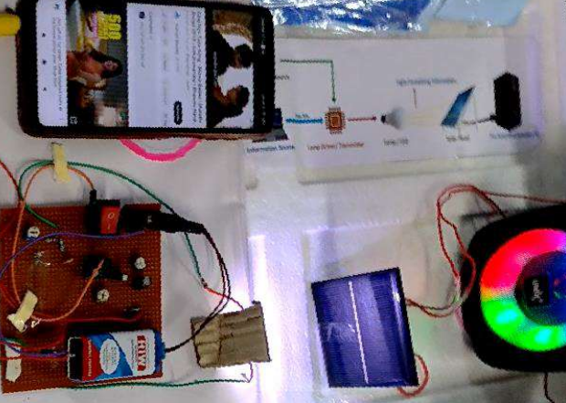

# 🎧 Audio Transmission using Light Fidelity (Li-Fi)

## Mini Project – Electronics & Telecommunication Engineering

---

## 📌 Project Overview

**Audio Transmission using Light Fidelity (Li-Fi)** is a hardware-based wireless communication project that demonstrates how **audio signals can be transmitted using visible light instead of radio waves**.  

In this system, an audio signal from a mobile device is amplified and used to modulate an LED. The modulated light carries the audio information and is received by a solar panel, which converts it back into an electrical signal and plays it through a speaker.

This project highlights the feasibility of **Li-Fi as a secure, RF-free alternative** for short-range audio communication.

---

## 🚀 Technology Stack

| Component | Purpose |
|---------|---------|
| 📡 Li-Fi | Light-based data transmission |
| 🔊 LM386 | Low-voltage audio amplifier |
| 💡 LED (1W) | Audio signal transmitter |
| ☀️ Solar Panel (12V) | Light signal receiver |
| 🔋 9V Battery | Power supply |

---

## ⚙️ Working Principle (Brief)

1. Audio input is given from a mobile phone using an AUX cable.
2. The LM386 amplifier boosts the audio signal.
3. The amplified signal modulates the LED intensity.
4. Light travels through free space to the receiver.
5. A solar panel converts light into an electrical signal.
6. The recovered audio is played through a speaker.

---

## 📸 Project Images

### 🔹 Project Setup & Team Work

### 🔹 Transmitter & Receiver Circuit

### 🔹 Final Working Model

---

## ✅ Key Features

- RF-free audio transmission  
- Secure line-of-sight communication  
- Low-cost and easy implementation  
- Suitable for RF-restricted environments  

---

## 🔮 Applications

- Hospitals and medical environments  
- Smart lighting systems  
- Secure indoor communication  
- Educational demonstrations  

---

## 🧾 Conclusion

This project successfully demonstrates **audio transmission using Li-Fi technology**, proving that visible light can be effectively used as a communication medium. The system offers advantages such as security, low interference, and simplicity, making Li-Fi a promising technology for future wireless applications.

---

